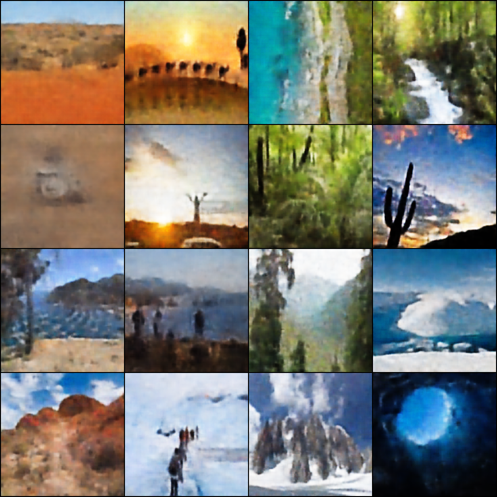

# Variational Autoencoder (VAE) for Landscape Images

An implementation of a **Variational Autoencoder (VAE)** for training on landscape images. Below, you'll find a detailed explanation of the code, and the mathematical intuition behind the VAE framework.

## What is a Variational Autoencoder (VAE)?

A Variational Autoencoder is a type of generative model that learns to encode input data (e.g., images) into a latent space and then reconstruct it back. The goal is to learn meaningful latent representations that can be used to generate new samples similar to the input data.


### Key Objectives of VAE

1. **Reconstruction Loss**: Ensure that the output is as close as possible to the input.
2. **Regularization (KL Divergence)**: Ensure that the latent space follows a standard normal distribution, which makes the sampling process easier and more robust. ( Without this the learned space might be very skewed to a particular distribution and sampling from might not be meaningful )

## Evidence Lower Bound (ELBO)

To train a VAE, we maximize the Evidence Lower Bound (ELBO), which can be written as:

**ELBO = E_q(z|x)[log p(x|z)] - KL(q(z|x) || p(z))**

In simple terms:

- The first term (**Reconstruction Loss**) measures how well the reconstructed data matches the input.
- The second term (**KL Divergence**) measures how close the latent space distribution `q(z|x)` is to the prior `p(z)`, which is typically a standard Gaussian distribution.

During training, we minimize the negative ELBO, which is equivalent to minimizing:

**Loss = Reconstruction Loss + β \* KL Divergence**

Here, `β` is a weight factor that controls the trade-off between the two terms (used in the **β-VAE** variant).

### Reconstruction Loss

For images, we often use **Binary Cross-Entropy (BCE)**:

**Reconstruction Loss = BCE(x, x̂)**

### KL Divergence

KL Divergence = -0.5 \* Σ (1 + log(σ²) - μ² - σ²)

Where `μ` and `σ` are the mean and standard deviation (or log variance) of the latent distribution learned by the encoder.

## Repository Overview

### Code Components

#### 1. **Model Architecture**

- **Encoder**: Maps the input image to a latent representation by extracting features through convolutional layers.
- **Latent Space**: Uses two linear layers to predict `μ` (mean) and `log(σ²)` (log variance) for the latent distribution.
- **Reparameterization Trick**: Combines `μ` and `σ` with random noise to create a latent vector `z`:

**z = μ + ε \* σ, where ε ~ N(0, 1)**

- **Decoder**: Reconstructs the input image from the latent vector `z` using transposed convolutional layers.

#### 2. **Dataset and Data Loading**

- The dataset is assumed to be organized into subdirectories for training, validation, and testing data.
- The images are loaded using the `LandscapeDataset` class and transformed to 256x256 resolution.

#### 3. **Training Loop**

- **Loss Function**: Combines Binary Cross-Entropy (BCE) and KL Divergence, scaled by a factor `β`.
- **Optimizer**: Adam optimizer with a learning rate of 0.001.
- **Outputs**:
- Saves the model weights after every epoch.
- Generates sample images from random latent vectors and saves them to the `samples/` directory.

### Key Functions

#### `encode`

Takes an input image and outputs `μ` and `log(σ²)` for the latent space.

#### `reparameterize`

Applies the reparameterization trick to sample a latent vector `z` from `N(μ, σ²)`.

#### `decode`

Takes a latent vector `z` and generates a reconstructed image.

#### `loss_function`

Calculates the total loss as:
**Loss = BCE(x, x̂) + β \* KL Divergence**

### Example Usage

1. **Dataset Preparation**
   Organize your dataset into subdirectories:

   ```
   Landscape Classification/
   |-- Training Data/
   |-- Validation Data/
   |-- Testing Data/
   ```

2. **Training**
   Run the training script to train the VAE on your dataset. The model will save generated samples and checkpoints after each epoch.

3. **Sample Generation**
   After training, use the decoder to generate new landscape images by sampling from the latent space.

### Installation

Ensure you have the required libraries:

```bash
pip install torch torchvision pillow
```

### Running the Code

```bash
python vae.py
```

## Sample Results

Generated samples will be saved in the `samples/` directory, with filenames like `sample_modifiedLoss_epoch_{epoch}.png`.



## Future Improvements

- Add support for more complex datasets.
- Experiment with different values of `β` for better disentanglement of latent features.
- Implement advanced loss functions like Wasserstein loss for smoother results.

## References

- [Kingma & Welling, 2014: Auto-Encoding Variational Bayes](https://arxiv.org/abs/1312.6114)
- [\( \beta \)-VAE](https://openreview.net/forum?id=Sy2fzU9gl)
